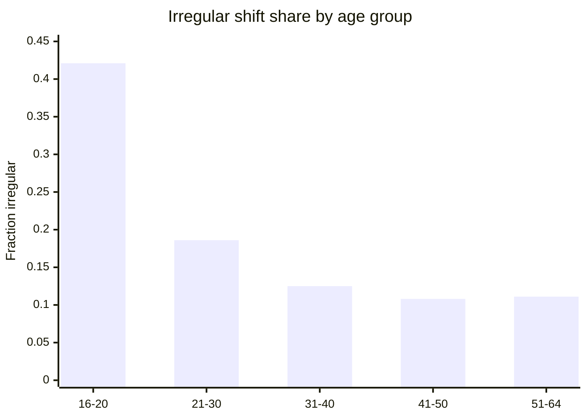
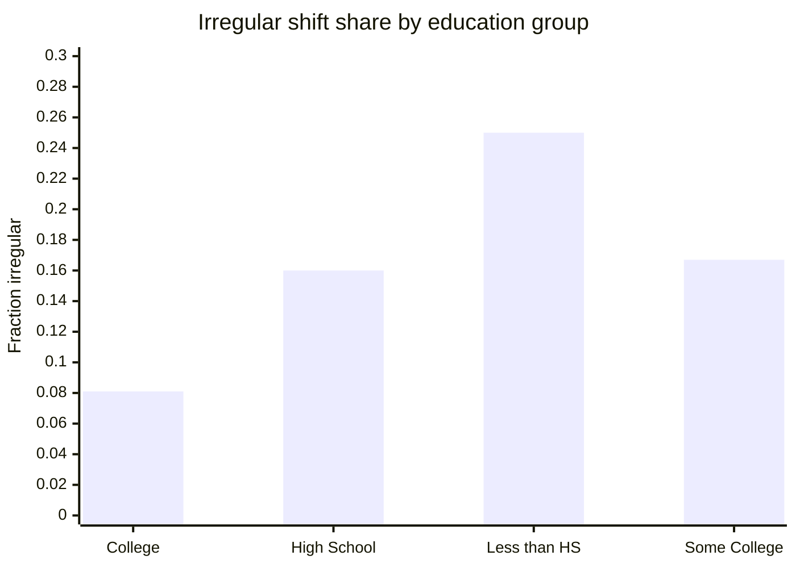
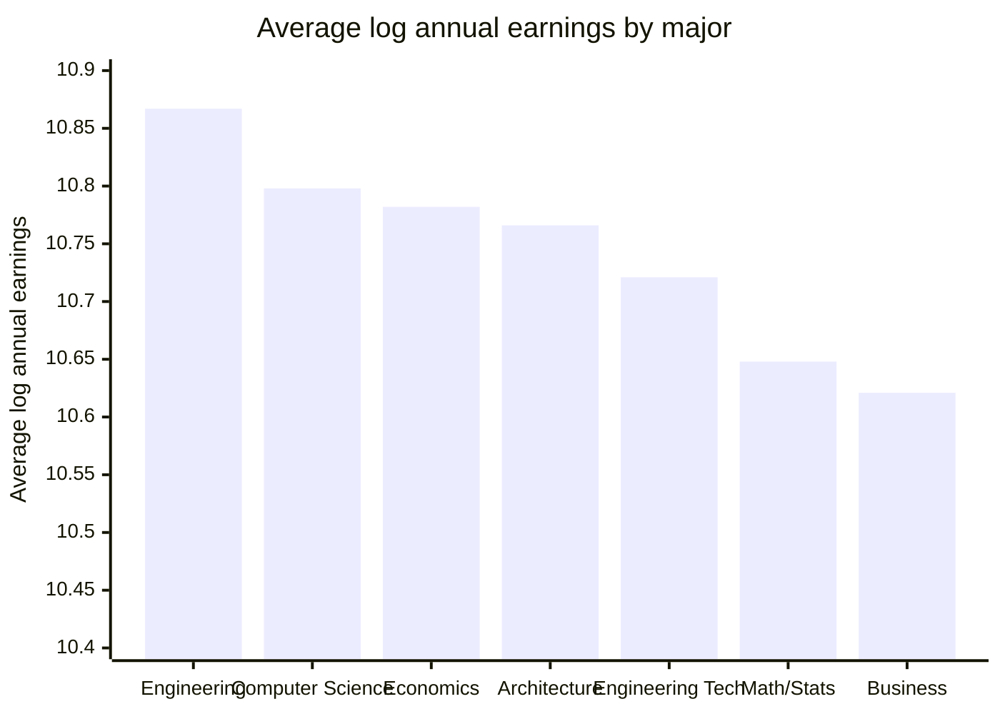

# Applied Labor Economics and Microdata Portfolio

This repository is a Python-based applied econometrics portfolio built around CPS/IPUMS-style microdata. It demonstrates how to clean large survey extracts, recode labor-market variables, construct wage and participation measures, estimate regression models, and generate reporting-ready tables and figures for labor-economics interpretation.

The repository is best presented as an **applied labor economics and microdata analysis portfolio**. It is not a production package; it is a collection of applied research scripts, outputs, and documentation from coursework-style empirical projects.

## Portfolio summary

| Area | Main question | Script | Outputs |
|---|---|---|---|
| Fertility and labor supply | How does labor-force participation vary by gender and parental status? | `Code/analysis` | line plots generated in script |
| Low-wage workforce demographics | Which demographic groups are most represented in low-wage work? | `Code/analysis2` | line plots generated in script |
| Night-shift / irregular-shift work | How do irregular shifts vary by age, education, and occupation, and how do wages differ? | `Code/analysis3` | CSV tables in `Graphs/` |
| College-major earnings | How do earnings and gender gaps vary across fields of study? | `Code/analysis4` | CSV tables and one committed PDF figure in `Graphs/` |
| Mincer earnings function | How do estimated returns to schooling and experience evolve over time by gender? | `Code/analysis5` | regression time-series plots generated in script |
| Classification exercise | How can logistic regression be evaluated with ROC/AUC diagnostics? | `Code2/problemset4.py` | ROC curve generated in script |

## Technical stack

- **Languages:** Python
- **Core libraries:** `pandas`, `NumPy`, `statsmodels`, `scikit-learn`, `matplotlib`, `seaborn`
- **Methods:** survey-data cleaning, weighted descriptive statistics, log-wage construction, recoding, Mincer-style earnings regressions, binary classification, ROC/AUC evaluation
- **Outputs:** CSV tables, regression summaries, diagnostic plots, and reproducible figures

## Key visual summaries

The following charts summarize selected committed outputs from the `Graphs/` folder. They are included here so the repository landing page communicates the empirical work without requiring the reader to run the scripts first.

### Irregular shift share by age group

Source: [`Graphs/age_irregular.csv`](Graphs/age_irregular.csv)



**Interpretation.** Irregular-shift work is most concentrated among the youngest workers in the sample. The 16--20 age group has a substantially higher irregular-shift share than prime-age and older workers.

### Irregular shift share by education group

Source: [`Graphs/education_irregular.csv`](Graphs/education_irregular.csv)



**Interpretation.** Irregular-shift work is highest among workers with less than a high-school education and lowest among college graduates in the cleaned sample.

### Mean hourly wage by education and shift regularity

Source: [`Graphs/wage_by_education_regularity.csv`](Graphs/wage_by_education_regularity.csv)

```mermaid
xychart-beta
    title "Mean hourly wage by education and shift regularity"
    x-axis ["College", "High School", "Less than HS", "Some College"]
    y-axis "Mean hourly wage" 0 --> 27
    bar "Irregular" [19.51, 11.83, 7.98, 12.71]
    bar "Regular" [24.64, 13.89, 9.92, 15.78]
```



**Interpretation.** Regular-shift workers have higher mean hourly wages in each education group shown here. The project treats this as descriptive evidence, not a causal estimate of shift premiums or penalties.

### Average log annual earnings by detailed college major

Source: [`Graphs/avg_log_earnings_detailed_by_major1.csv`](Graphs/avg_log_earnings_detailed_by_major1.csv)



**Interpretation.** Engineering, computer and information sciences, economics, architecture, engineering technologies, mathematics/statistics, and business appear near the top of the cleaned young-college-graduate earnings distribution.

### Committed figure output

The repository also includes a committed PDF visualization from the college-major earnings analysis:

- [`Graphs/gender_earnings_relationship_weighted1.pdf`](Graphs/gender_earnings_relationship_weighted1.pdf) — scatter plot relating the female share of workers in a major/field to average male log annual earnings.

## Project details

### 1. Fertility and labor supply

**Script:** [`Code/analysis`](Code/analysis)

This analysis studies labor-force participation by gender and parental status. It loads CPS-style variables for sex, age, year, labor-force status, number of children under five, and survey weights. It then constructs participation measures and visualizes participation trends by sex and family status.

Skills demonstrated:

- Microdata loading and variable selection with `pandas`
- Survey-weighted labor-force participation construction
- Grouped time-series summaries by year, sex, and parental status
- Labor-market visualization with `matplotlib` and `seaborn`

### 2. Demographics of the low-wage workforce

**Script:** [`Code/analysis2`](Code/analysis2)

This analysis constructs an hourly wage measure from weekly earnings, usual hours worked, and reported hourly wages. It then identifies low-wage workers and studies the composition of low-wage work by age, race/ethnicity, education, and gender.

Skills demonstrated:

- Wage-variable cleaning and validity filtering
- Race/ethnicity and education recoding
- Construction of a low-wage-worker indicator
- Grouped demographic composition analysis
- Visualization of labor-market inequality patterns

### 3. Compensating differentials and night-shift work

**Script:** [`Code/analysis3`](Code/analysis3)

This analysis studies irregular-shift work and wage differences. It filters working-age employees, constructs log hourly wages, identifies irregular-shift status, recodes education and age groups, and generates tables by education, age, and selected occupations.

Committed outputs:

- [`Graphs/age_irregular.csv`](Graphs/age_irregular.csv)
- [`Graphs/education_irregular.csv`](Graphs/education_irregular.csv)
- [`Graphs/specified_occupations_irregular.csv`](Graphs/specified_occupations_irregular.csv)
- [`Graphs/wage_by_education_regularity.csv`](Graphs/wage_by_education_regularity.csv)
- [`Graphs/wage_by_occupation_regularity.csv`](Graphs/wage_by_occupation_regularity.csv)

Skills demonstrated:

- Applied labor-economics data cleaning
- Log wage construction
- Shift-work indicator design
- Occupation-level grouping and summary-table generation
- Export of reproducible CSV tables for reporting

### 4. Wage differences across college majors

**Script:** [`Code/analysis4`](Code/analysis4)

This analysis studies earnings differences across college majors for young college graduates. It maps degree-field codes to interpretable major categories, filters a 2019 sample, computes weighted log annual earnings, separates Economics from other social sciences, and constructs gender-gap and major-composition summaries.

Committed outputs:

- [`Graphs/avg_log_earnings_by_major.csv`](Graphs/avg_log_earnings_by_major.csv)
- [`Graphs/avg_log_earnings_by_major_weighted.csv`](Graphs/avg_log_earnings_by_major_weighted.csv)
- [`Graphs/avg_log_earnings_detailed_by_major.csv`](Graphs/avg_log_earnings_detailed_by_major.csv)
- [`Graphs/avg_log_earnings_detailed_by_major1.csv`](Graphs/avg_log_earnings_detailed_by_major1.csv)
- [`Graphs/gender_wage_gap_by_major.csv`](Graphs/gender_wage_gap_by_major.csv)
- [`Graphs/gender_earnings_relationship_weighted1.pdf`](Graphs/gender_earnings_relationship_weighted1.pdf)

Skills demonstrated:

- Degree-field code mapping and categorical recoding
- Weighted earnings summaries by major
- Gender-gap construction by field of study
- Sample restrictions and minimum-cell-size filters
- Export of earnings tables and visualization outputs

### 5. Mincer earnings function over time

**Script:** [`Code/analysis5`](Code/analysis5)

This analysis estimates Mincer-style earnings regressions by year and sex over a long historical window. It constructs log weekly earnings, maps education codes into approximate years of schooling, computes potential experience and squared experience, and tracks estimated returns to schooling and experience from 1964 through 2022.

Skills demonstrated:

- Long-horizon microdata panel construction
- Education-to-schooling recoding
- Potential-experience feature engineering
- Year-by-year regression estimation with `statsmodels`
- Visualization of returns to schooling and experience over time

### 6. Logistic regression and ROC/AUC classification exercise

**Script:** [`Code2/problemset4.py`](Code2/problemset4.py)

This exercise trains a logistic regression classifier, creates a train/test split, computes predicted probabilities, and evaluates classification performance with an ROC curve and AUC score.

Skills demonstrated:

- Binary classification with `scikit-learn`
- Train/test splitting
- ROC curve construction
- AUC-based model evaluation

## Output index

| Output | Description |
|---|---|
| [`Graphs/age_irregular.csv`](Graphs/age_irregular.csv) | Irregular-shift counts and shares by age group |
| [`Graphs/education_irregular.csv`](Graphs/education_irregular.csv) | Irregular-shift counts and shares by education group |
| [`Graphs/specified_occupations_irregular.csv`](Graphs/specified_occupations_irregular.csv) | Irregular-shift shares for selected occupations |
| [`Graphs/wage_by_education_regularity.csv`](Graphs/wage_by_education_regularity.csv) | Mean hourly wages by education and shift regularity |
| [`Graphs/wage_by_occupation_regularity.csv`](Graphs/wage_by_occupation_regularity.csv) | Mean hourly wages by occupation and shift regularity |
| [`Graphs/avg_log_earnings_by_major.csv`](Graphs/avg_log_earnings_by_major.csv) | Average log annual earnings by broad major group |
| [`Graphs/avg_log_earnings_by_major_weighted.csv`](Graphs/avg_log_earnings_by_major_weighted.csv) | Weighted average log annual earnings by broad major group |
| [`Graphs/avg_log_earnings_detailed_by_major.csv`](Graphs/avg_log_earnings_detailed_by_major.csv) | Detailed major-level average log earnings |
| [`Graphs/avg_log_earnings_detailed_by_major1.csv`](Graphs/avg_log_earnings_detailed_by_major1.csv) | Detailed major-level weighted average log earnings |
| [`Graphs/gender_wage_gap_by_major.csv`](Graphs/gender_wage_gap_by_major.csv) | Male/female weighted log earnings and gender gaps by major |
| [`Graphs/gender_earnings_relationship_weighted1.pdf`](Graphs/gender_earnings_relationship_weighted1.pdf) | Scatter plot linking female field composition to average male log annual earnings |

## Reproducibility notes

The scripts expect CPS/IPUMS-style input files in local `Data/` or `Data2/` folders and save generated tables or figures into `Graphs/` or `Graphs2/`. File paths may need to be adjusted before running outside the original Codespaces/workspace environment.

Recommended workflow:

1. Create a Python environment.
2. Install the dependencies listed below.
3. Place the required CPS/IPUMS-style microdata extracts in the expected data folders.
4. Run the analysis scripts from the repository root or update paths to match your local environment.

## Dependencies

```bash
pip install pandas numpy statsmodels scikit-learn matplotlib seaborn
```

## Repository status

This repository is a coursework and applied-analysis portfolio. It emphasizes data cleaning, reproducible analysis panels, labor-economics interpretation, regression workflows, and reporting-ready tables/figures. It is not intended to be a production software package.
